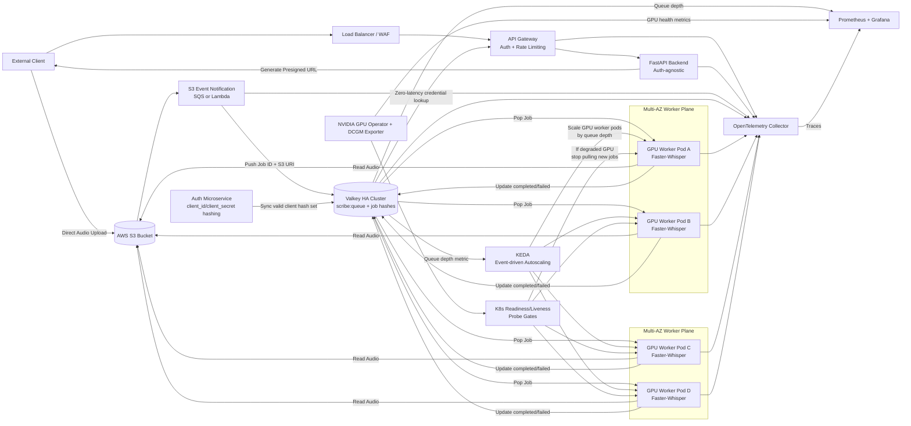

# Production Readiness Architecture Diagram

## Notes

- This is the production target architecture for Open-ASR and intentionally removes local audio spooling from the ingestion path.
- The API process manages control-plane metadata only; binary data plane traffic goes directly client -> S3.
- Queue depth is the primary autoscaling input for GPU workers.
